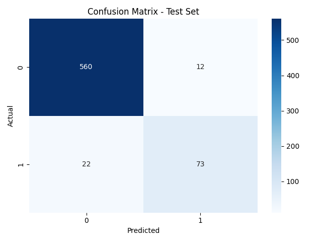
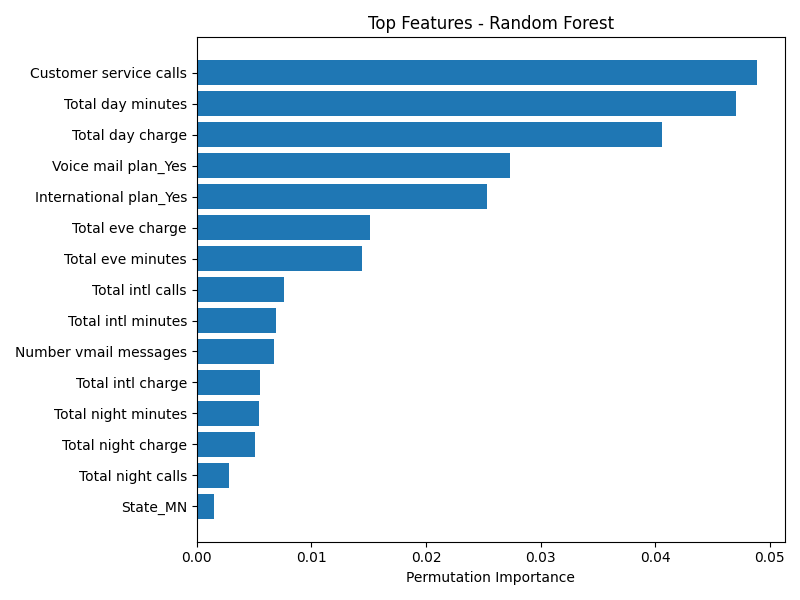

# 🧑‍💻 Task 1 - Random Forest Classifier (Churn Prediction)

This project was developed as part of my **Codveda Internship**.  
The goal was to implement a **Random Forest Classifier** on a real-world dataset (Customer Churn Prediction) to identify which customers are likely to churn (leave the service).

---

## 📌 Objectives
- Train and evaluate a **Random Forest** model.  
- Perform **hyperparameter tuning** (number of trees, max depth, etc.).  
- Evaluate the model with cross-validation and key metrics:  
  - Accuracy  
  - Precision  
  - Recall  
  - F1-score  
  - ROC AUC  
- Perform **feature importance analysis** to understand which variables drive churn.  
- Visualize results with confusion matrix and feature importance plots.

---

## 📂 Dataset
- **Dataset**: Churn prediction data (provided by Codveda).  
- **Split**:  
  - `churn-bigml-80.csv` → 80% training data  
  - `churn-bigml-20.csv` → 20% test data  

Target variable:  
- `True` = Customer churned  
- `False` = Customer retained  

---

## ⚙️ Tools & Libraries
- Python 🐍  
- [Scikit-learn](https://scikit-learn.org/stable/)  
- [Pandas](https://pandas.pydata.org/)  
- [Matplotlib](https://matplotlib.org/)  
- [Seaborn](https://seaborn.pydata.org/)  

---

## 🚀 Results

### 🔹 Cross-validation (Train Set)
- **Accuracy:** 93.85%  
- **F1-score (Churn class):** 0.768  

### 🔹 Final Test Set
- **Accuracy:** 94.90%  
- **F1-score (Churn class):** 0.811  
- **ROC AUC:** 0.92  

---

## 📊 Visualizations

### Confusion Matrix


### Top 10 Feature Importances


---

## 📈 Insights
- The model achieved **~95% accuracy** on the test set.  
- Important features influencing churn:  
  - `Customer service calls`  
  - `Total day minutes`  
  - `Total day charge`  
  - `Voice mail plan`  
  - `International plan`  

This suggests that **customer behavior (calls, usage) and service plans** strongly affect churn likelihood.

---

## ▶️ How to Run
1. Clone this repository:
   ```bash
   git clone https://github.com/LinaAmiri/ML-INTERNSHIP-PROJECTS.git
   cd Task1 - Random Forest Classifier

2. Install dependencies:
   pip install -r requirements.txt

3. Run the script:
   python random_forest.py


👩‍💻 Developed by Lina Amiri as part of Codveda ML Engineering Internship (Task 1)